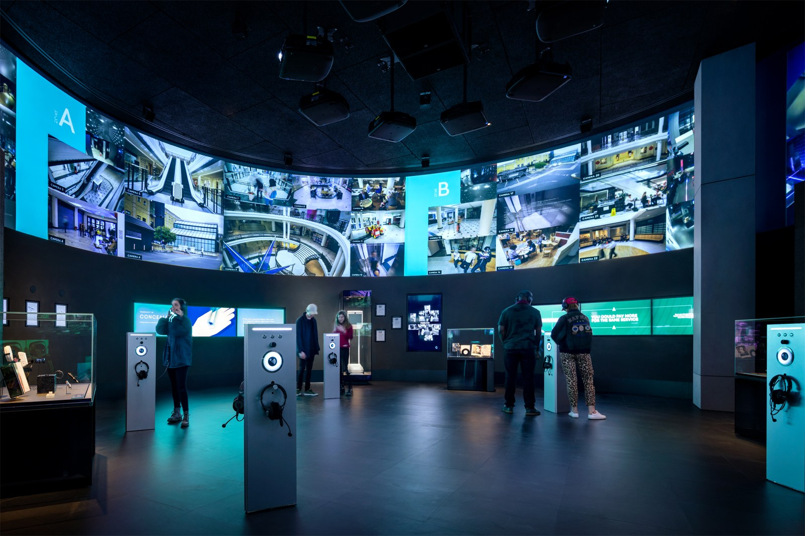
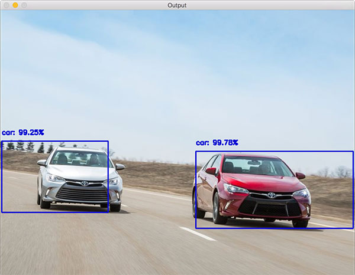

# Logging system for real-time object detections 

### Features:

- tools for adding bboxes and corresponding labels.
- flexible to add more labels and its confidences and categories.
- an example code for object detection is provided.
- The code is developed using Test-Driven-Development.

**Use this command to run tests**

`python -m unittest test_with_simple_input.py`

An example json for the above image could be this:

    {
     "video_details": {
     "frame_width": 1080,
     "frame_height": 720,
     "frame_fps": 20,
     "video_name": "test.avi"
     },
     "frames": [
     {
     "frame_id": 1,
     "bboxes": [
     {
     "bbox_id": "0",
     "labels": [
     {
     "category": "car",
     "confidence": 99.25
     },
     { 
     "category": "truck",
     "confidence": 57.14
     }
     ],
     "left": 5,
     "top": 400,
     "width": 250,
     "height": 145
     },
     {
     "bbox_id": "1",
     "labels": [
     { 
     "category": "car",
     "confidence": 99.78
    },
     { 
     "category": "bus",
     "confidence": 65.23
     }],
     "left": 650,
     "top": 450,
     "width": 300,
     "height": 150
     }]
     }]

